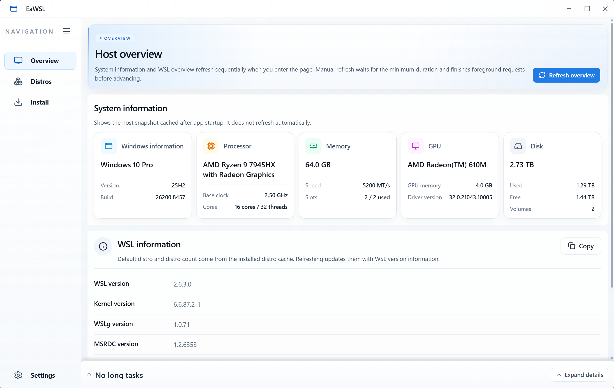

# EaWSL

语言：[English](../README.md) | 简体中文

EaWSL 是面向 Windows 11 x64 的 WSL 图形化管理桌面应用，使用 SvelteKit、Tauri 2 和 Rust 构建。

此项目未经过多系统和多个 WSL 版本的测试，在部分环境中可能无法正常运行。

## 截图

| 概览 | 发行版 |
| --- | --- |
|  |  |

## 功能

- 查看 Windows、硬件、磁盘和 WSL 版本信息。
- 管理已安装发行版：状态、默认发行版、停止、删除和导出。
- 在线安装 WSL 发行版，支持自定义名称、安装位置和固定大小 VHDX。
- 从 `.tar`、`.tar.gz`、`.tar.xz` 和 `.vhdx` 文件导入发行版。
- 跟踪安装、导入、导出等长任务进度。
- 在破坏性操作或长任务前校验磁盘空间、路径、文件和发行版名称。
- 配置语言、默认安装位置和后台刷新目标。
- 支持 English 和简体中文界面。

## 运行

安装前端依赖：

```powershell
pnpm install
```

启动 Tauri：

```powershell
pnpm tauri dev
```
